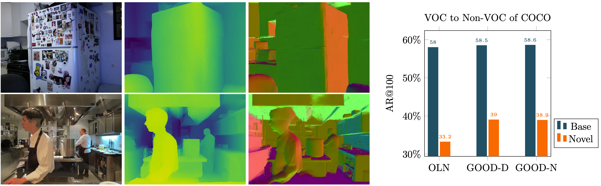

# GOOD: Exploring geometric cues for detecting objects in an open world

This repository is the official implementation of [GOOD: Exploring geometric cues for detecting objects in an open world](https://arxiv.org/abs/2212.11720) (ICLR 2023). 

## What is it?

We address the task of open-world class-agnostic object detection, i.e., detecting every object in an image by learning from a limited number of base object classes. State-of-the-art RGB-based models suffer from overfitting the training classes and often fail at detecting novel-looking objects. This is because RGB-based models primarily rely on appearance similarity to detect novel objects and are also prone to overfitting short-cut cues such as textures and discriminative parts. 
To address these shortcomings of RGB-based object detectors, we propose ***incorporating geometric cues such as depth and normals***, predicted by  general-purpose monocular estimators.

As we can see from the following figure, geometric cues are much more generalizable across different categories, and can effectively narrow the generalization gap between base (known) and novel (unknown) categories.
Our method has achieved **SOTA results** on many open-world detection benchmarks including COCO Person to non-Person, VOC to non-VOC, LVIS COCO to non-COCO, and COCO to UVO.



## How we do it?
As shown in the following figure, we use the geometric cues to train an object proposal network for pseudo-labeling unannotated novel objects in the training set. The top-ranked pseudo boxes are added to the annotation pool for  Phase II training, i.e., a class-agnostic object detector is directly trained on the RGB input using both the base class and pseudo annotations. At inference time, we only need the model from Phase II.


## Pre-trained Weights

You can download pretrained weights here:

| Training | Eval | url | OLN AR_N@100 | GOOD AR_N@100 |
|:---:|:---:|:---:|:---:|:---:|
| Person, COCO | Non-Person, COCO | [Pseudo-box](https://drive.google.com/drive/folders/1zJd6Lgm2dGbt3dzLmMOQ4G6V6dg_yeo6?usp=share_link)/[GOOD](https://drive.google.com/file/d/1CLknTPCfvxA2jNw9aYsIgORZgK78VmCE/view?usp=sharing) | 16.5 | 26.2 | 
| VOC, COCO | Non-VOC, COCO |  [Pseudo-box](https://drive.google.com/drive/folders/1KLEUkulebFo7ByKR6gTOnRre74hrlhgX?usp=sharing)/[GOOD](https://drive.google.com/file/d/1wVm9uFiCjY21oPyEvdw0bWqjrQ4cNLrw/view?usp=sharing) | 33.2 | 39.3 |
| COCO | [Non-COCO, LVIS](https://drive.google.com/file/d/1k3blgwu76OrI8haQ8Z9PPB2NrPd98_PW/view?usp=sharing) | [Pseudo-box](https://drive.google.com/drive/folders/1yeibVXcyHcbCdXZbQJRpeJeOnunm8xJ_?usp=sharing)/[GOOD](https://drive.google.com/file/d/1mL3BvZDMAOms0et_CyShQwT7F_xfaNFi/view?usp=sharing) | 27.4 | 29.0 | 


For all GOOD models, we find the optimal number k for pseudo labels is 1. Due to some modifications of the evaluation code, the numbers are slightly different from the papers.


## Installation

This repository is based on [mmdetection](https://github.com/open-mmlab/mmdetection) and [OLN](https://github.com/mcahny/object_localization_network).

You can use following commands to create conda env with related dependencies.

```setup
conda create -n good python=3.8 -y
conda activate good
conda install pytorch=1.7.0 torchvision -c pytorch
conda install cuda -c nvidia
pip install mmcv-full -f https://download.openmmlab.com/mmcv/dist/cu110/torch1.7.0/index.html
pip install -v -e . 
```


## Extracting geometric cues

Please refer to [Omnidata repositories](https://github.com/EPFL-VILAB/omnidata/tree/main/omnidata_tools/torch) for the pretrained models. We provide an example code for extracting depth and normal [here](tools/extract_outputs.py). Please put it in the same repository as Omnidata repository to use it.


## Phase-I training and generating pseudo-labels

To train the Phase-I model, run this command:

```train
python tools/train_good.py configs/good/phase1_depth.py
```

After training, you can run this command to extract pseudo labels and generate a COCO-format annotation file:

```
python tools/test_extract_proposals.py configs/good/phase1_depth.py path-to-checkpoint/latest.pth --eval bbox --modality depth --out path-to-save-pseudo-box-json
```

## Phase-II training

To train the Phase-II model, run this command:

```train
python tools/train_good.py configs/good/phase2_good.py
```

Note the difference of config files from Phase-I. You need to specify the filenames of the pseudo boxes in the config file.


## Evaluation

To evaluate the model, run:

```eval
python tools/test_good.py configs/good/phase2_good.py path-to-checkpoint/latest.pth --eval bbox
```

## To cite this work:

```bibtex
@inproceedings{
    huang2023good,
    title={{GOOD}: Exploring geometric cues for detecting objects in an open world},
    author={Haiwen Huang and Andreas Geiger and Dan Zhang},
    booktitle={The Eleventh International Conference on Learning Representations },
    year={2023},
    url={https://openreview.net/forum?id=W-nZDQyuy8D}
}
```


## License

This code repository is open-sourced under [MIT license](LICENSE).


For a list of other open source components included in this project, see the file [3rd-party-licenses.txt](3rd-party-licenses.txt).


